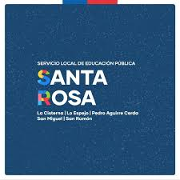
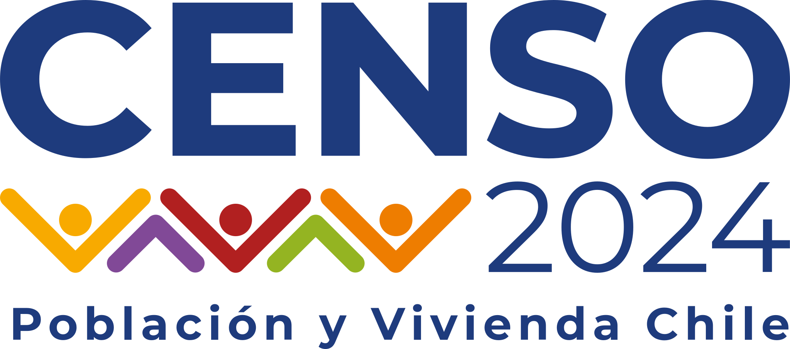

```{r}
#| echo: false
library(htmltools)
library(purrr)
```

::: {.callout-note appearance="simple"}
📄 **[Descargar CV en PDF](documentos/cv_Benjamin_Lang_2026.pdf)**
:::

## 👤 Sobre mí {.seccion-titulo}

Soy sociólogo titulado con **distinción máxima** por la Universidad Diego Portales (2017–2021), especializado en análisis de datos, investigación social y ciencia de datos. Mi trabajo se sitúa en la intersección entre metodología cuantitativa, análisis de sistemas complejos y humanidades digitales.

Actualmente me desempeño como **Analista de datos** en el Servicio Local de Educación Pública Santa Rosa (SLEP), donde lidero la sistematización, visualización y análisis de datos educacionales para la toma de decisiones.

Mi experiencia combina investigación académica rigurosa, procesamiento de grandes volúmenes de información y diseño metodológico innovador en instituciones como el **Instituto Nacional de Estadísticas (INE)**, el **Centro de Estudios Públicos (CEP)** y en proyectos **Fondecyt** enfocados en gobernanza económica y transiciones socio-ambientales.

---

## 🎓 Formación académica {.seccion-titulo}

::: {.grid}

::: {.g-col-12 .g-col-md-8}
**Sociólogo titulado con distinción máxima** · 2017–2021
Universidad Diego Portales · Santiago, Chile
*Primero en el ranking de egreso de la generación.*

**Diplomado de honor en movilidad y transporte** · 2019–2020
Universidad Diego Portales · Santiago, Chile
:::

::: {.g-col-12 .g-col-md-4}
{.logo-institucion fig-alt="Logo Universidad Diego Portales"}
:::

:::

---

## 💼 Trayectoria laboral {.seccion-titulo}

### Analista de datos {.trabajo-titulo}

::: {.trabajo-bloque}

::: {.grid}
::: {.g-col-12 .g-col-md-9}
**Servicio Local de Educación Pública Santa Rosa (SLEP)** · Septiembre 2025 – presente

Responsable de la sistematización, visualización y análisis de datos educacionales. Diseño de dashboards y reportes para la gestión educacional regional. [Ver página del proyecto →](https://sites.google.com/slepsantarosa.cl/datos-usointerno/inicio?authuser=2)
:::
::: {.g-col-12 .g-col-md-3}
{.logo-trabajo fig-alt="Logo SLEP Santa Rosa"}
:::
:::

:::

### Analista metodológico Senior {.trabajo-titulo}

::: {.trabajo-bloque}

::: {.grid}
::: {.g-col-12 .g-col-md-9}
**Instituto Nacional de Estadísticas (INE)** · Mayo 2024 – Junio 2025

Responsable del procesamiento, validación y análisis de datos en el **Censo de Población y Vivienda 2024**. Diseño y aplicación de metodologías estadísticas, aseguramiento de calidad de bases de datos a gran escala y elaboración de reportes técnicos para la toma de decisiones. [Ver sitio oficial del Censo 2024 →](https://censo2024.ine.gob.cl/)
:::
::: {.g-col-12 .g-col-md-3}
{.logo-trabajo fig-alt="Logo Censo 2024 INE"}
:::
:::

:::

### Investigador — Proyecto Fondecyt N°1231356 {.trabajo-titulo}

::: {.trabajo-bloque}

**Universidad Diego Portales / Fondecyt** · Mayo 2024 – Agosto 2025

*"Gobernar la incertidumbre: gramáticas, actores y dispositivos de producción de 'estabilidad' económica en el capitalismo contemporáneo. Un estudio sobre el Banco Central de Chile (2006–2022)"*. Análisis de datos cualitativos y cuantitativos sobre políticas económicas; manejo de grandes volúmenes de información documental y construcción de indicadores para evaluar dispositivos institucionales de estabilidad económica.

:::

### Investigador asistente — *Voces del CEP* {.trabajo-titulo}

::: {.trabajo-bloque}

::: {.grid}
::: {.g-col-12 .g-col-md-9}
**Centro de Estudios Públicos (CEP)** · Abril 2023 – Abril 2024

Responsable de la gestión editorial del boletín [*Voces del CEP*](https://www.cepchile.cl/categoria-de-investigacion/voces-del-cep/), incluyendo la **coordinación, organización y publicación de artículos** de análisis sobre problemas públicos contemporáneos. Me encargué del flujo completo de publicación: coordinación con autores, edición, estructuración de contenidos y gestión de la plataforma. Seguimiento del segundo proceso constitucional chileno (2023). Sistematización estadística de información electoral y opinión pública.
:::
::: {.g-col-12 .g-col-md-3}
{.logo-trabajo fig-alt="Logo CEP"}
:::
:::

:::

### Asistente de investigación — Proyecto C22 {.trabajo-titulo}

::: {.trabajo-bloque}

::: {.grid}
::: {.g-col-12 .g-col-md-9}
**Centro de Estudios Públicos (CEP)** · Agosto 2021 – Abril 2024

Análisis socio-constitucional C22. Especializado en humanidades digitales del primer proceso constitucional chileno. Análisis de discursos, procesamiento de datos textuales y visualización de información política. [Ver proyecto →](https://c22cepchile.cl/)
:::
::: {.g-col-12 .g-col-md-3}
{.logo-trabajo fig-alt="Logo C22 CEP"}
:::
:::

:::

### Analista de asuntos públicos {.trabajo-titulo}

::: {.trabajo-bloque}

::: {.grid}
::: {.g-col-12 .g-col-md-9}
**Tironi y Asociados** · Agosto 2021 – Marzo 2023

Encargado del **boletín constitucional 2022**, un producto de monitoreo semanal del proceso constituyente que sistematizaba información política e institucional para clientes corporativos y públicos. Recopilación, limpieza y análisis de información política, así como seguimiento legislativo y del debate público.

Contribuí en proyectos de **consultoría estratégica** con énfasis en análisis de datos para diagnóstico organizacional, monitoreo de opinión pública y diseño de estrategias comunicacionales. Participé en la elaboración de reportes para clientes del sector público y privado, integrando información cuantitativa y cualitativa para la toma de decisiones estratégicas.
:::
::: {.g-col-12 .g-col-md-3}
{.logo-trabajo fig-alt="Logo Tironi y Asociados"}
:::
:::

:::

### Asesor metodológico — Proyectos Joaquín Prieto {.trabajo-titulo}

::: {.trabajo-bloque}

**Investigación académica independiente** · 2025 – presente

Asesoría en investigación cuantitativa en los proyectos ***Insecurity amid Recovery*** y ***Economic Insecurity, Not Inequality?*** del investigador **Joaquín Prieto**. Análisis con la **Encuesta ELSOC del COES** (panel longitudinal) y la **Encuesta de Bienestar Social (EBS) del INE**. Procesamiento y modelamiento estadístico con R, apoyo en el diseño metodológico y análisis de datos de panel.

:::

### Asistente de investigación — Fondecyt N°1190295 {.trabajo-titulo}

::: {.trabajo-bloque}

**Universidad Diego Portales** · Marzo 2022 – Marzo 2023

*"Gobernando transiciones críticas en sistemas socio-ecológicos: el caso de Chiloé, Chile"*. Procesamiento de información cualitativa y cuantitativa para la investigación de transiciones críticas en sistemas socio-ambientales.

:::

---

## 🎓 Paso por la universidad {.seccion-titulo}

::: {.intro-pagina}
Durante mis estudios en la Universidad Diego Portales participé activamente como **ayudante de cátedra** y **tesista** en proyectos de investigación, consolidando mi formación en metodología, teoría social e investigación aplicada.
:::

```{r}
#| echo: false

ayudantias <- list(
  list(
    fecha   = "Agosto 2020 – Agosto 2021",
    titulo  = "Tesista — Proyecto Fondecyt N°1181585",
    lugar   = "Universidad Diego Portales",
    desc    = "Participación en proyecto Fondecyt de investigación sociológica, articulando el trabajo de tesis de pregrado con una línea de investigación financiada."
  ),
  list(
    fecha   = "Marzo – Julio 2021",
    titulo  = "Ayudante — Técnicas cuantitativas",
    lugar   = "Cátedra de Macarena Orchard · UDP",
    desc    = "Apoyo docente en metodología cuantitativa: estadística descriptiva, inferencial y análisis de datos con software especializado."
  ),
  list(
    fecha   = "Agosto – Diciembre 2020",
    titulo  = "Ayudante — Lógica de investigación",
    lugar   = "Cátedra de Sara Correa · UDP",
    desc    = "Apoyo en la enseñanza de diseño de investigación, formulación de preguntas, hipótesis y construcción de marcos teóricos."
  ),
  list(
    fecha   = "Marzo – Julio 2020",
    titulo  = "Ayudante — Teoría Sociológica IV",
    lugar   = "Cátedra de Modesto Gayo · UDP",
    desc    = "Apoyo docente en teoría sociológica contemporánea: discusión de autores, ejercicios de análisis teórico y retroalimentación a estudiantes."
  ),
  list(
    fecha   = "Marzo – Julio 2020",
    titulo  = "Ayudante — Métodos cualitativos",
    lugar   = "Cátedras de Tomás Ariztía y Camila Peralta · UDP",
    desc    = "Apoyo docente en diseño y análisis cualitativo: entrevistas, observación, etnografía y análisis de discurso."
  ),
  list(
    fecha   = "Marzo – Julio 2020",
    titulo  = "Ayudante — Problemas sociales",
    lugar   = "Cátedra de Jorge Atria · UDP",
    desc    = "Apoyo en el análisis sociológico de problemas sociales contemporáneos: desigualdad, estratificación y políticas públicas."
  )
)

div(class = "timeline",
  map(ayudantias, \(a) {
    div(class = "timeline-item",
      div(class = "timeline-fecha", a$fecha),
      div(class = "timeline-titulo", a$titulo),
      div(class = "timeline-lugar", a$lugar),
      tags$p(a$desc)
    )
  })
)
```

---

## 🛠️ Habilidades técnicas {.seccion-titulo}

### Softwares

- **RStudio / R:** avanzado (tidyverse, ggplot2, Quarto, análisis estadístico, modelación)
- **Power BI:** avanzado (dashboards interactivos, DAX, visualización corporativa)
- **Excel:** avanzado (análisis, macros, modelado financiero)
- **GitLab / GitHub:** avanzado (control de versiones, colaboración, CI/CD básico)
- **Atlas.ti:** intermedio (análisis cualitativo de textos y entrevistas)
- **Python:** básico (pandas, análisis exploratorio)

### Idiomas

- 🇨🇱 **Español:** nativo
- 🇬🇧 **Inglés:** C1 (fluido)
- 🇮🇹 **Italiano:** C1 (fluido)

---

## 🎯 Intereses de investigación {.seccion-titulo}

Investigación social y análisis de sistemas complejos · Ciencia de datos y análisis cuantitativo · Metodologías innovadoras en investigación social · Humanidades digitales · Gobernanza y políticas públicas · Análisis de discursos y datos textuales.

---

## 📰 Publicaciones destacadas {.seccion-titulo}

**Frei, R., Cordero, R., Lang, B., Rozas, J., & Rodríguez, J. P.** (2024). *"Claims of ownership, claims of dignity: Moral narratives on the right to housing in Chile's constitutional referendum"*. **Journal of Language and Politics**, 23(5), 723–746. [https://doi.org/10.1075/jlp.24097.fre](https://doi.org/10.1075/jlp.24097.fre)

<a href="publicaciones.qmd" class="btn-secundario">Ver todas las publicaciones →</a>

---

## 🎤 Actividades académicas {.seccion-titulo}

- **Junio 2024** — Seminario *"Inteligencia artificial y ciencias sociales: herramientas, expectativas y limitaciones"* para estudiantes de Sociología, Universidad Diego Portales.
- **Abril 2022** — Ponencia en el Congreso Chileno de Sociología **PRE-ALAS** (Concepción): *"Estéticas constitucionales: una mirada desde los regímenes estéticos de la revuelta social chilena de 2019"*.
- **Marzo 2022** — Seminario *"Metodologías visuales: una aproximación sociológica para trabajar con imágenes"*, Universidad Diego Portales.

---

## 📞 Referencias {.seccion-titulo}

::: {.grid}

::: {.g-col-12 .g-col-md-6}
::: {.referencia-card}
**Verónica Canales**
*Jefa de área de metodología y procesamiento — CENSO Población y Vivienda 2024 · INE.*
Magíster en Investigación Social (LSE).
📧 [vacanalesg@ine.gob.cl](mailto:vacanalesg@ine.gob.cl)
:::
:::

::: {.g-col-12 .g-col-md-6}
::: {.referencia-card}
**Aldo Mascareño**
*Investigador Senior del CEP · Editor General de Estudios Públicos · Investigador principal C22.*
📧 [amascareno@cepchile.cl](mailto:amascareno@cepchile.cl)
:::
:::

::: {.g-col-12 .g-col-md-6}
::: {.referencia-card}
**Francisco Espinoza**
*Consultor · Tironi y Asociados.*
Magíster en Ciencia Política, Universidad de Chile.
📧 [francisco.espinoza@tironi.cl](mailto:francisco.espinoza@tironi.cl)
:::
:::

:::

---

## 📧 Contacto {.seccion-titulo}

::: {.grid}
::: {.g-col-12 .g-col-md-6}
**📧 Email**
[benjalang1997@gmail.com](mailto:benjalang1997@gmail.com)

**📱 Teléfono**
+56 9 6309 5562

**🔗 LinkedIn**
[benjamin-lang-a78229207](https://www.linkedin.com/in/benjamin-lang-a78229207/)

**🐙 GitHub**
[github.com/Langab](https://github.com/Langab)
:::
::: {.g-col-12 .g-col-md-6}
**🏛️ Institución**
Servicio Local de Educación Pública Santa Rosa

**📍 Ubicación**
Región de Los Lagos, Chile
:::
:::
