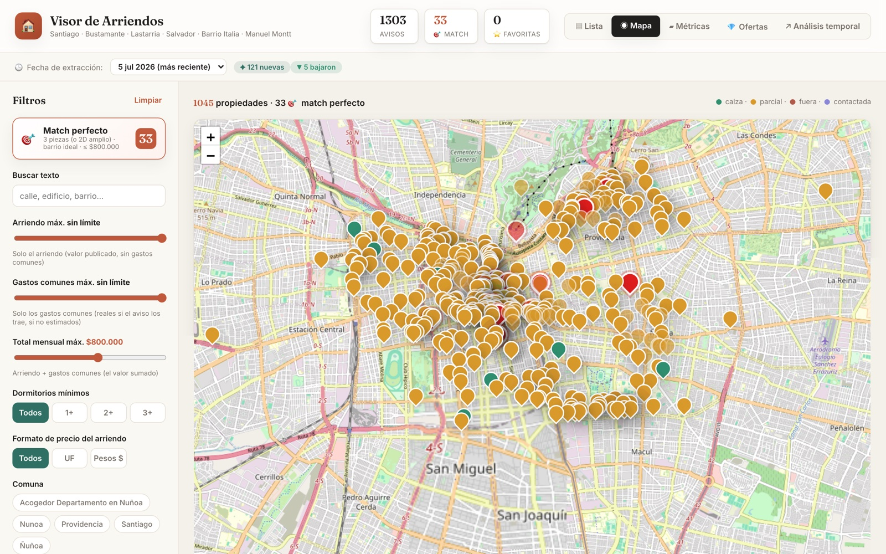
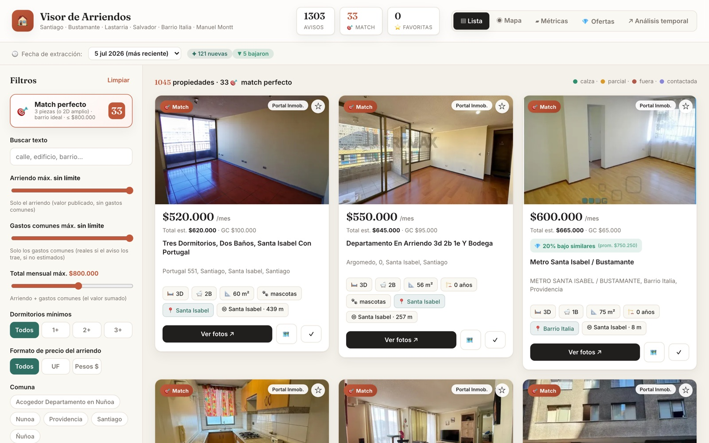
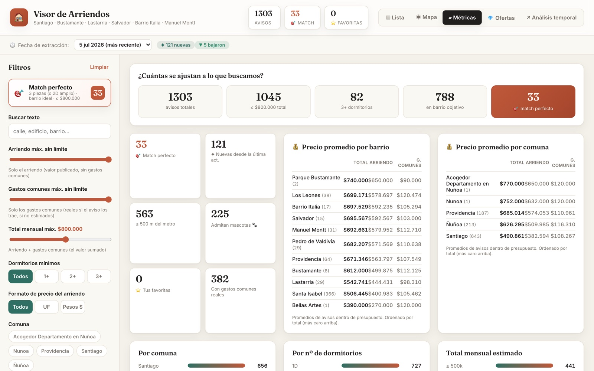

::: {.callout-tip appearance="simple"}
🔗 **El resultado final está publicado y se actualiza solo todos los días:**
[**langab.github.io/visor_arriendos/viewer**](https://langab.github.io/visor_arriendos/viewer/){target="_blank"} ·
[Código en GitHub](https://github.com/Langab/visor_arriendos){target="_blank"}
:::

## El problema: buscar arriendo en Santiago es un trabajo de tiempo completo

Todo partió con una conversación muy poco técnica: con mi compañero de casa
decidimos mudarnos y teníamos claro lo que buscábamos — un departamento de
**3 dormitorios** (2 para dormir + 1 de oficina, o un 2D amplio que diera para
lo mismo), en el eje **Parque Bustamante · Lastarria · Salvador · Barrio Italia
· Manuel Montt**, con un tope de **$800.000 mensuales *incluyendo* gastos
comunes**.

Suena razonable, ¿no? El problema es que buscar eso a mano es una pesadilla:

- Los avisos están **repartidos en cinco portales** distintos (Portal
  Inmobiliario, Chilepropiedades, Yapo, TocToc, GoPlaceIt…), y el mismo
  departamento aparece repetido en varios.
- Los **gastos comunes casi nunca se publican** en el listado, así que ese
  "arriendo en $700.000" puede ser en realidad un total de $850.000.
- Muchos precios vienen **en UF**, otros en pesos, y comparar exige convertir.
- Los buscadores de los portales no entienden "cerca del metro" ni "en mi
  barrio objetivo", y menos "un 2D que sirva de 3D".

Después de una semana de pestañas abiertas y planillas a medio llenar, hice lo
que cualquier analista de datos haría: **convertir la pregunta en un problema
de datos** y construir la herramienta que quería usar.

{.lightbox fig-alt="Mapa de Santiago con cientos de pins de propiedades en arriendo"}

## La arquitectura: un pipeline de punta a punta

El diseño es deliberadamente simple y modular. Cada pieza hace una sola cosa y
se puede correr por separado:

```
visor_arriendos/
├── config.py            ← los criterios de búsqueda (comunas, presupuesto, dormitorios)
├── run_all.py           ← orquestador: corre todo con un comando
├── scrapers/            ← un scraper por portal, mismo esquema de salida
│   ├── base.py          ← dataclass común + utilidades (precios, UF, guardado)
│   ├── portalinmobiliario.py
│   ├── chilepropiedades.py
│   └── yapo.py          ← anti-bot con Scrapling/Camoufox
├── consolidate.py       ← une fuentes, deduplica, enriquece, puntúa
├── geocode.py           ← direcciones → lat/lng (Nominatim + cache)
├── metro.py             ← distancia a la estación de metro más cercana
├── enrich_pi.py         ← Playwright: gastos comunes reales, antigüedad, mascotas
└── viewer/              ← visor 100% estático (HTML + JS + Leaflet)
```

El flujo completo es: **scrapers → JSON crudos por portal → consolidación →
geocodificación → enriquecimiento → `data.js` → visor estático**. Un solo
comando lo actualiza todo:

```bash
python run_all.py          # scrapea + consolida + geocodifica + arma el visor
```

La decisión de arquitectura más importante fue definir **un esquema común**
antes de escribir el primer scraper. Cada portal tiene su HTML distinto, pero
todos terminan produciendo la misma estructura:

```python
@dataclass
class Listing:
    fuente: str                       # portal de origen
    url: str                          # link al aviso oficial
    titulo: str = ""
    precio_clp: Optional[int] = None  # arriendo en CLP (convertido si venía en UF)
    gastos_comunes_clp: Optional[int] = None
    dormitorios: Optional[int] = None
    banos: Optional[int] = None
    superficie_m2: Optional[float] = None
    direccion: str = ""
    comuna: str = ""
    barrio: str = ""
    lat: Optional[float] = None
    lng: Optional[float] = None
    id: str = ""                      # id estable para deduplicar

    def fill_id(self):
        """Genera un id estable a partir de la URL (sin querystring)."""
        clave = self.url.split("?")[0].split("#")[0].strip().lower()
        self.id = hashlib.md5(clave.encode("utf-8")).hexdigest()[:16]
        return self
```

Gracias a esto, el consolidador no sabe (ni le importa) de qué portal viene
cada aviso. Agregar un portal nuevo es escribir un archivo que devuelva
`list[Listing]` y nada más.

## Scraping: cada portal es un mundo

Acá está la parte entretenida (y la más sufrida). Ningún portal se scrapea
igual:

| Portal | Técnica | Dificultad |
|---|---|---|
| Portal Inmobiliario | `requests` + HTML estático | 🟢 La fuente principal |
| Chilepropiedades | `requests` + HTML estático | 🟢 Rápido y completo |
| Yapo | **Scrapling/Camoufox** (navegador sigiloso) | 🟡 Bloquea `requests`; ~40 s/página |
| TocToc / GoPlaceIt | Interceptar su API interna (XHR) | 🔴 Pendiente |
| Facebook Marketplace | Import manual por CSV | ✋ Su scraping viola los ToS |

Una lección temprana: buscar por *comuna* en Portal Inmobiliario se queda corto
porque la paginación se agota antes de cubrir toda la zona. La solución fue
scrapear **por barrio** usando los slugs de sus facetas de ubicación, lo que
garantiza cobertura fina justo donde nos importa.

Otro clásico chileno: los precios llegan como `"$ 750.000"`, `"UF 13,5"` o
`"13,5 UF"`. La conversión toma el valor UF **en vivo** desde
[mindicador.cl](https://mindicador.cl), con fallback si la API no responde:

```python
def parse_precio(texto: str) -> tuple[Optional[int], str]:
    """Convierte un precio publicado a CLP. Reconoce '$ 750.000', 'UF 13,5'…"""
    original = texto.strip()
    t = original.upper().replace("\xa0", " ")
    es_uf = "UF" in t
    num = re.sub(r"[^\d.,]", "", t)      # deja solo dígitos, comas y puntos
    if es_uf:
        num = num.replace(".", "").replace(",", ".")   # UF usa coma decimal
        return int(round(float(num) * uf_to_clp())), original
    num = num.replace(".", "").replace(",", "")        # CLP: puntos = miles
    return int(num), original
```

Y un detalle que salvó la calidad de los datos: entre los resultados de
arriendo se cuelan avisos de **venta**. ¿Cómo detectarlos sin metadata? Regla
simple y efectiva — ningún arriendo mensual cuesta $158.000.000:

```python
def filtrar_invalidos(listings):
    """Descarta avisos de VENTA colados (precio mensual imposible)."""
    return [l for l in listings
            if not (l.get("precio_clp") and l["precio_clp"] > 5_000_000)]
```

## Deduplicación: el mismo depto con tres caras

Con ~1.300 avisos de varias fuentes, los duplicados son inevitables: el mismo
departamento publicado por dos corredoras, o cruzado entre portales. La
estrategia es doble — primero por **id estable** (hash de la URL), y luego por
una **clave secundaria** de dirección normalizada + precio:

```python
def deduplicar(listings):
    vistos_id, vistos_clave, out = {}, set(), []
    for l in listings:
        if l["id"] in vistos_id:
            continue
        # atrapa el mismo aviso republicado o cruzado entre fuentes
        clave = f"{_norm(l.get('direccion',''))}|{l.get('precio_clp')}"
        if clave.strip("|") and clave in vistos_clave:
            continue
        vistos_id[l["id"]] = l
        vistos_clave.add(clave)
        out.append(l)
    return out
```

## Geocodificación: del texto "Portugal 551" a un pin en el mapa

Para el mapa necesitaba coordenadas, y los avisos solo traen direcciones en
texto (a veces bastante creativas). Uso **Nominatim** (OpenStreetMap): gratis,
sin API key, pero con dos restricciones que definieron el diseño:

1. **1 request por segundo.** Con más de mil direcciones, geocodificar todo de
   cero toma ~20 minutos. La solución: un **cache en JSON** que persiste entre
   corridas — re-ejecutar el pipeline solo consulta las direcciones nuevas.
2. **No todo geocodifica.** Direcciones como "Los Leones 600 - 900" o
   "Providencia con Salvador" confunden al geocodificador, así que primero se
   limpian (rangos, intersecciones). Y si aun así falla, hay un **fallback en
   cascada**: centroide del barrio → centroide de la comuna, con un
   desplazamiento pseudo-aleatorio determinístico para que los pins
   aproximados no se apilen en un mismo punto:

```python
if not l.get("lat"):
    cen = _barrio_centroide(direccion) or COMUNA_CENTROIDES.get(comuna)
    if cen:
        h = int(l["id"][:6], 16)   # hash del aviso → jitter reproducible
        l["lat"] = cen[0] + ((h % 100) - 50) / 8000.0
        l["lng"] = cen[1] + ((h // 100 % 100) - 50) / 8000.0
        l["ubicacion_aprox"] = True
```

Así **toda** propiedad aparece en el mapa, y las aproximadas quedan marcadas
como tales.

### Bonus: distancia al metro sin scrapear nada

"Cerca del metro" era un criterio clave y ningún portal lo informa bien. Pero
no hace falta scraping: con las coordenadas de cada aviso y las de las
estaciones de las líneas 1, 3, 5 y 6 de la zona, basta la **fórmula de
haversine**:

```python
def _haversine_m(lat1, lng1, lat2, lng2) -> float:
    R = 6_371_000  # radio de la Tierra en metros
    p1, p2 = math.radians(lat1), math.radians(lat2)
    dp = math.radians(lat2 - lat1)
    dl = math.radians(lng2 - lng1)
    a = math.sin(dp/2)**2 + math.cos(p1) * math.cos(p2) * math.sin(dl/2)**2
    return 2 * R * math.asin(math.sqrt(a))
```

Cada tarjeta del visor muestra "Santa Isabel · 257 m" calculado con 23
estaciones hardcodeadas en 40 líneas de Python. A veces la solución más simple
es la correcta.

## El "match perfecto": codificar lo que realmente buscábamos

El corazón del proyecto es traducir nuestra búsqueda humana a una regla
computable. No era solo "3 dormitorios bajo $800.000": un 2D amplio con
espacio de oficina también servía. Eso se volvió configuración y lógica:

```python
# Un 2D amplio (≥ 68 m²) sirve como oficina y también califica.
sirve_layout = dorm >= config.DORMITORIOS_OBJETIVO or \
    (dorm >= 2 and sup >= config.SUPERFICIE_MIN_2D_M2)

# MATCH PERFECTO: layout que sirve + barrio objetivo + total ≤ presupuesto
l["match_perfecto"] = bool(
    sirve_layout and l["dentro_presupuesto"] and l["en_barrio_objetivo"]
)
```

Ojo con `dentro_presupuesto`: se calcula sobre el **total estimado** (arriendo
+ gastos comunes). Cuando el aviso no publica los GC —la mayoría—, se usa una
estimación configurable y el visor lo marca como "GC est.". Para los avisos
importantes, un módulo aparte (`enrich_pi.py`) abre la ficha de detalle con
**Playwright** (la página solo carga con JavaScript) y extrae los **gastos
comunes reales**, la antigüedad del edificio y si admite mascotas 🐾, con su
propio cache para no repetir lo ya visitado.

Además, cada aviso recibe un **puntaje de relevancia (0–100)** que pondera
presupuesto, dormitorios, barrio y cercanía al metro, y con eso se ordena todo
el visor: lo más prometedor siempre arriba.

## ¿Está caro o es una oferta? Comparar contra el grupo correcto

Un precio solo es "caro" o "barato" comparado con algo comparable. El pipeline
agrupa los avisos por **ubicación × dormitorios × baños × tramo de m²** y
compara el arriendo de cada uno contra la **mediana** de su grupo (robusta a
outliers). Si el grupo fino tiene menos de 5 avisos, cae en cascada a grupos
más gruesos:

```
1. barrio + dorms + baños + m²   (lo más comparable)
2. barrio + dorms + m²
3. comuna + dorms + m²
4. comuna + dorms
```

Un aviso 10% bajo la mediana de su grupo se etiqueta como **oferta** 💎 y tiene
su propia pestaña en el visor. Es un análisis sencillo, pero convirtió al visor
en algo más útil que cualquier portal: no solo muestra qué hay, sino **qué
conviene**.

## El visor: 100% estático, cero backend

La decisión final de diseño: el visor es **HTML + CSS + JavaScript puro**, sin
framework, sin servidor, sin base de datos. El consolidador escribe los datos
como un archivo `data.js`:

```javascript
// Generado automáticamente por consolidate.py — no editar a mano.
window.META = {"total": 1303, "match_perfecto": 33, ...};
window.LISTINGS = [...];
```

¿Por qué un `.js` y no un `.json`? Porque un JSON cargado con `fetch()` falla
por CORS al abrir el HTML directo desde el disco; un `<script src="data.js">`
funciona en cualquier lado — incluyendo GitHub Pages, donde el visor vive
gratis.

{.lightbox fig-alt="Vista de lista del visor con tarjetas de propiedades"}

El mapa usa **Leaflet + OpenStreetMap** (sin API key), con pins coloreados
según cuánto calza cada aviso: 🎯 match perfecto · 🟢 calza · 🟡 parcial ·
🔴 fuera. Las **favoritas ⭐** y **contactadas ✓** se guardan en
`localStorage`, así que persisten entre sesiones sin necesidad de cuentas ni
backend.

Y la vista de **métricas** responde la pregunta original con un embudo: de
1.303 avisos, 1.045 caben en el presupuesto, 82 tienen 3+ dormitorios, 788
están en un barrio objetivo… y **33 son match perfecto**. De "mil pestañas
abiertas" a "33 candidatos concretos".

{.lightbox fig-alt="Dashboard de métricas del visor con embudo y precios promedio"}

## Automatización: el visor se actualiza solo

La gracia de tener un pipeline es que nadie tiene que acordarse de correrlo.
Un **LaunchAgent de macOS** (`launchd`, el cron nativo del Mac) ejecuta todo
diariamente a las 10:00: scrapea, consolida, saca la **foto del día** y hace
`git push` a GitHub Pages.

```bash
launchctl load ~/Library/LaunchAgents/com.visorarriendos.daily.plist
```

Cada corrida guarda un snapshot completo en `viewer/historia/<fecha>.js` (se
conservan 30 días), lo que habilita la parte más interesante del visor: el
**análisis temporal**. Comparando la foto de hoy con las anteriores, el visor
sabe qué avisos son **✦ nuevos**, cuáles **▼ bajaron de precio** y cuáles
desaparecieron (¿se arrendó? 🤔). El selector de fecha permite viajar en el
tiempo y ver el mercado tal como estaba cualquier día del último mes.

## Lo que me llevo del proyecto

Más allá de que sí nos sirvió para buscar departamento (los 33 matches son
reales y varios ya están visitados), el proyecto es un buen ejemplo de algo que
me gusta defender: **estructurar un proyecto de datos completo desde cero para
resolver un problema real**, con decisiones de ingeniería en cada capa:

- **Esquema común primero**, scrapers después → agregar fuentes es trivial.
- **Caches en todo lo caro** (geocodificación, fichas de detalle) → re-ejecutar
  es barato y amable con los servicios externos.
- **Fallbacks en cascada** (UF en vivo → fallback; dirección exacta → barrio →
  comuna) → el pipeline nunca se cae por un dato faltante.
- **Salida estática** → hosting gratis, cero mantención, funciona offline.
- **Automatización desde el día uno** → los datos se mantienen frescos solos.

¿Lo replicarías para tu propia búsqueda? El [código está en
GitHub](https://github.com/Langab/visor_arriendos){target="_blank"} y los
criterios viven todos en `config.py`: cambia las comunas, el presupuesto y los
barrios, corre `python run_all.py`, y tienes tu propio visor.

::: {.callout-note appearance="simple"}
👀 **Explora el visor en vivo:**
[langab.github.io/visor_arriendos/viewer](https://langab.github.io/visor_arriendos/viewer/){target="_blank"}
— prueba el botón 🎯 *Match perfecto* y la pestaña 💎 *Ofertas*.
:::
